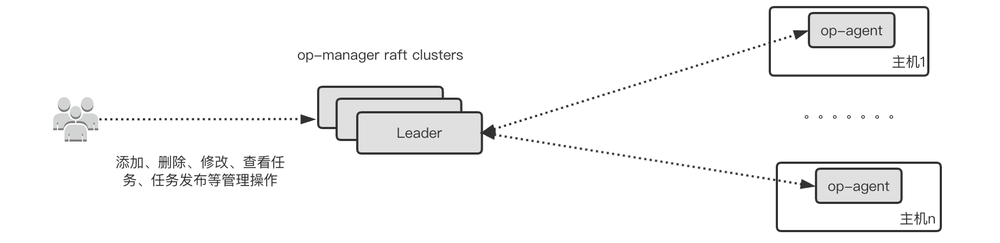

# op-agent
op-agent是一款轻量级的agent，可以实现在物理机上部署任务、管理任务、定时执行、API功能暴露等功能，并采用中心化配置管理方式，可以很方便的为其他系统提供子模块功能。

# 架构

[架构图无法显示？](https://blog.csdn.net/liuhanran/article/details/123163437)
* op-manager： op-manager是管理节点，用来管理op-agent，在管理节点上可以配置任务、查看任务、查看任务执行的日志等等。op-manager可以是单个节点，也可以部署成raft集群。
* op-agent： 运行在线上物理机上的agent组件。

# 主要功能
* 部署定时任务：
通过op-agent管理的定时任务更具可控性，可设置脚本执行超时时间，可防止同一时间多次执行，可查看脚本执行日志等
* 部署一次性任务：可以设置脚本一次性执行
* 设置某些机器为白名单或黑名
* 通过op-agent提供的API功能远程调用脚本任务：
可以异步/同步地远程调用任务，并可接收参数传递, 此功能可把agent功能作为其他模块的子模块，比如初始化系统、备份系统、巡检系统等
* 脚本文件或项目目录上传：
可以把本地python脚本推送到所有安装了op-agent的机器上
* 任务编辑、查看、管理等：
op-agent最核心的功能就是运行任务，我们可以编辑一个任务的属性，比如任务执行路径、执行周期、超时控制等功能
* 节点状态查看：
查看agent的状态，比如哪些机器的agent挂掉了或者agent没有上报自己的心跳

# 安装和使用
### 快速上手

[1.最简架构部署](./docs/install_document.md)

### 线上部署

[1.线上标准部署](./docs/standard_deployment.md)

### agentCli命令行工具
agentCli命令行工具是操作op-manager、op-agent唯一的入口，重要子命令有get、logs、upload、download、save、analysis几个重要的子命令，可以方便的添加任务、管理任务、查看资源状态等。
```
./agentCli --help
Example:
agentCli get nodes [IP|HOSTNAME] [–o wide]
agentCli get jobs [JOBNAME]
agentCli get packages [PACKAGENAME]
agentCli logs <HOSTIP|ALL> [LIMIT] [–o wide|short]
agentCli upload <FILE|DOCUMENT> [deploymentDirName]
agentCli download [VERSION]
agentCli rollback
agentCli save <task.json>
agentCli top
agentCli analysis <packages|jobs> [jobName] [onceJobVersion]

Usage:
agentCli [command]

Available Commands:
get View <nodes|jobs|packages> information
logs View the log information of a task
save Create a task
logs View the log information of a task
download Download the specified version of the task package
upload Upload task package or executable file
rollback rollback the specified version of the task package
analysis Analyze <packages|jobs> status
help Help about any command
completion generate the auto completion script for the specified shell

Flags:
–config string config file name. (default “./agentCli.conf.json”)
-h, --help help for agentCli
-v, --version version for agentCli

Use “agentCli [command] --help” for more information about a command.
```
#### 节点状态查看
op-agent会部署在物理机上，那么我们需要能很方便的查看这些部署了agent的状态，比如哪些机器的agent挂掉了或者agent没有上报自己的心跳信息到metadb，这样我们可以准确的维护数据库机器的状态。

#### packages上传、下载、资源查看等
如果需要把本地的shell脚本、python项目、go项目等部署到所有服务器运行，我们需要把本地的项目打包保上传，然后并发的推送到所有机器上，agentCli提供了packages管理的所有功能，比如打包上传、下载、资源列表操作。

#### 任务编辑、查看、管理等
op-agent最核心的功能就是运行任务，围绕任务，我们可以编辑一个任务的属性，比如任务执行路径、执行周期、超时控制、任务执行状态分析等功能。

#### Analysis、log功能
对于任务的运行状态、每台机器上的任务package是否有缺失等，我们需要能够快速的获得这些信息，agentCli提供了packages状态查看、任务运行分析，查看任务运行日志等能力。


### 使用案例
#### 在所有部署了agent的机器上一次性执行ls -l /tmp命令
```
#编辑任务
vim ll.json
{
  "JobName": "ls-l",
  "Command": "ls -l /tmp",

  "CronExpr": "",
  "OnceJob": 1,
  "Timeout": 10,
  "SynFlag": 1,

  "Enabled": 1,
  "WhiteHosts": [
  ],
  "BlackHosts": [
  ]
}

#部署任务
cd /data/op-manager/
./agentCli save ll.json

#查看任务
./agentCli get jobs
./agentCli get jobs ls-l

#查看所有机器执行的日志输出
./agentCli logs ls-l
#查看某台机器执行日志
./agentCli logs ls-l 172.16.123.144 --o wide

```

#### 在所有部署了agent的机器一次性执行python脚本
```
vim python_test.json
{
  "JobName": "test.py",
  "Command": "python /data/op-agent/src/python_project_dir/test.py",

  "CronExpr": "",
  "OnceJob": 1,
  "Timeout": 10,
  "SynFlag": 1,

  "Enabled": 1,
  "WhiteHosts": [
  ],
  "BlackHosts": [
  ]
}

#上传pyton项目包
./agentCli upload python_project_dir /data/op-agent/src 
#此命令是把python_project_dir目录上传到/data/op-agent/src下
#也可以直接上传python文件
./agentCli upload test.py /data/op-agent/src

#部署任务
cd /data/op-manager/
./agentCli save python_test.json

#查看任务
./agentCli get jobs
./agentCli get jobs test.py

#查看所有机器执行的日志输出
./agentCli logs test.py
#查看某台机器执行日志
./agentCli logs test.py 172.16.123.144 --o wide

```

#### 部署周期性cron任务
```
vim cycleTest.json
{
  "JobName": "cycleTest.py",
  "Command": "python /data/op-agent/src/cycleTest.py",

  "## Here are some demos": "",
  "## Seconds, Minutes, Hours, Day of month, Month, Day of week, Year": "* * * * * * *",
  "## Execute 10 seconds": "*/10 * * * * * *",
  "## Execute every minute": "0 */1 * * * * *",
  "## Execute every hour": "0 0 */1 * * * *",

  "CronExpr": "*/5 * * * * * *",
  "OnceJob": 0,
  "Timeout": 10,
  "SynFlag": 0,

  "Enabled": 1,
  "WhiteHosts": [
  ],
  "BlackHosts": [
  ]
}

#上传pyton脚本
./agentCli upload  cycleTest.py /data/op-agent/src

#部署任务
cd /data/op-manager/
./agentCli save cycleTest.json

#查看任务
./agentCli get jobs
./agentCli get jobs cycleTest.py

#查看所有机器执行的日志输出
./agentCli logs cycleTest.py
#查看某台机器执行日志
./agentCli logs cycleTest.py 172.16.123.144 --o wide

```

#### 部署一个任务，测试API功能
```
vim apiTest.json
{
  "JobName": "apiTest.py",
  "Command": "python /data/op-agent/src/apiTest.py --host '{host}' --port '{port}'",

  "CronExpr": "",
  "OnceJob": 0,
  "Timeout": 0,
  "SynFlag": 0,

  "Enabled": 1,
  "WhiteHosts": [
  ],
  "BlackHosts": [
  ]
}

#上传pyton脚本
./agentCli upload apiTest.py /data/op-agent/src

#部署任务
cd /data/op-manager/
./agentCli save apiTest.json

#查看任务
./agentCli get jobs
./agentCli get jobs apiTest.py

#远程通过接口执行
curl -s --connect-timeout 2 -u opuser:w95fa8cw403fc220db1f4csde2130bsfd http://127.0.0.1:7070/api/opAgent -d '{"jobname":"apiTest.py", "host":"192.168.1.1", "port":"3306"}' 

#说明
通过远程调用agent api 并传递参数host和port执行本地脚本, 上面的命令会被调用agent机器上执行python /data/op-agent/src/apiTest.py --host '192.168.1.1' --port '3306'
```

#### 查看所有安装了agent机器列表
```
./agentCli get nodes
HOSTNAME		IP	          STATUS		VERSION		FIRSTSEEN		LASTSEEN		
op-agent-test01		192.168.1.1	  Ready			1.0.1		2022-10-04 08:02:19	2022-10-02 09:32:02	
op-agent-test02		192.168.1.2	  Ready			1.0.1		2022-10-04 08:03:10	2022-10-02 09:32:05	

```

#### 查看在agent上部署了哪些任务
```
./agentCli get jobs
JOBNAME		COMMAND				CRONEXPR		ONCEJOB		TIMEOUT		ADDTIME			LASTUPDATED		STATUS
ls-l		ls -l /tmp						1		10		2022-10-03 15:01:49	2022-10-03 15:01:49	Enabled
```

#### 查看在agent上部署了哪些脚本或package
```
./agentCli get packages
PACKAGENAME		PACKAGEVERSION			TIMESTAMP		DEPLOYDIR
test.py			1630935031			2022-10-03 15:20:10	/data/op-agent/src
```

### 常见问题
#### 通过agentCli get nodes 没有发现已经安装了agent机器的列表
agent会通过3种方式跟op-manager交互信息（上传自己的信息、获得最新的任务脚本以及执行包）。
1. agent启动的时候会一次性上传自己的信息到元数据库，所以agent所在的机器会连接元数据库，检查agent到元数据库的连通性，用户权限等
2. agent会周期性主动跟op-manager交换信息，周期时间可以通过agent的配置文件ContinuesDiscoverWithInSeconds参数设置，检查agent所在机器到op-manager API端口连通性（op-manager API端口：ListenAddress配置）
3. op-manager会周期性并发的跟agent主动交换信息，周期时间可以通过op-manager配置文件DiscoverOpAgentIntervalLists设置，检查op-manager所在机器到agent API端口的连通性（agent API端口：ListenAddress配置）

#### 通过agentCli save 命令在agent上部署任务没生效
通过agentCli save xx.json 会把任务保存到元数据库，通过上面3种模式交换信息的时候，agent会获得最新的任务，请检查上面三种方式的连通性。

#### 通过agentCli upload 上传的文件或包没有分发到agent所在的机器上
agentCli upload 会把文件或者包保存到后端数据库，通过上面3种方式交换信息的时候，agent可以发现有最新的包需要下载，agent会连接元数据库下载最新的可执行文件或包，请检查agent到元数据库MySQL的连通性。op-manager会做并发控制（默认100）的分发文件或包。

通过命令agentCli analysis packages 可以发现有哪些机器还没有同步文件或包，由于某些原因同步失败，可以自行登录元数据库，select * from agent_package_task 查看任务队列表， fail_reason字段是失败原因，清理掉相关条目会重新生成任务。


自动文件或包下载管理方式可能不是很可靠（以二进制的方式把文件或包保存到数据库，远端agent连接数据库下载），用户也可以自行通过ssh，把可执行文件或包推到所有agent机器上。
